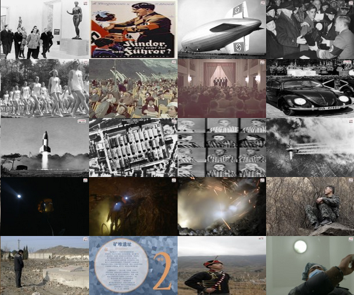

## PHP 常用类库总结归纳

* [ Pdo 封装类库 ] (./php_class/PdoMySQL.class.php)
* [ 数据 转 json 或者 xml ] (./php_class/response.php)
* [ Redis 封装类库] (./php_class/Redis.class.php)
* [ Memcache 封装类库] (./php_class/Memcache.class.php)
* [ 分页类] (./php_class/page.class.php) 
* [ 文件上传类 ](./php_class/fileUpload.class.php)
* [ 微信开发类库 ](./php_class/weixin.php)
* [ faceplusplus 人脸识别接口 ](./php_class/face.class.php)
* [jquery.more.js 点击加载更多 ](./php_class/jquery.more.js)
* [使用 strtotime() 产生今天,本周,本月时间戳的范围](./php_class/strtotime.php)
* [Nginx 配置虚拟主机,配置文件](./php_class/Nginx_VirtualHost.txt)
* [获取当前页面的url](./php_class/getUrl.php)

> [ 人脸识别接口 项目的源码](./php_class/face)
  注意要使用自己的 API_KEY API_SECRATY
  

* [cookie 类库 ](./php_class/cookie.class.php)
* [session 类库 ](./php_class/session.class.php)
* [Jpgraph 类库用于 php 绘制图表使用 ] (./php_class/jpgraph)
* [练习使用 phpquery 抓取网站上的内容 ](./php_class/exe_phpquery.php)
* [Spider 一个递归的抓取网站上的图片 ] (./php_class/spider.php)
* [抓取 网易看客 上的图片的类, Just for fun ](./php_class/SeizeImg.class.php)
* [rabbitMq 消费者代码,面向对象](./php_class/rabbitMq.php)
> 

